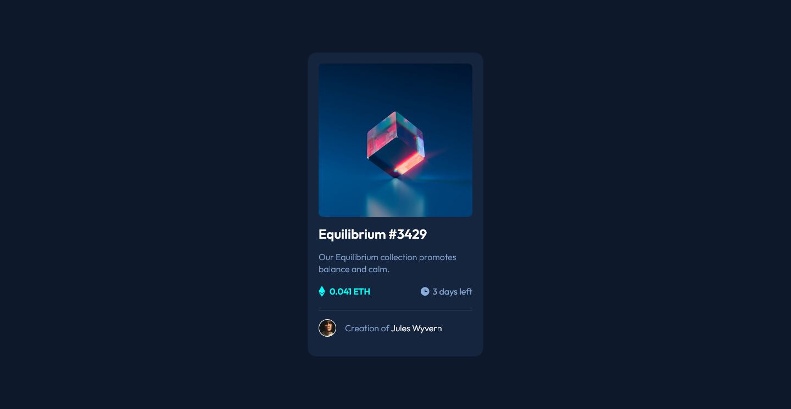

# 💻 NFT Preview | Frontend Mentor

## 📖 Description

This is a NFT Preview card component made with HTML and CSS, based on the challenge provided by *Frontend Mentor*.

## 🔨 Features

* HTML
* CSS + Custom Properties
* BEM Convention
* Flexbox
* Responsiveness
* Coded with Visual Studio Code

## 🖼️ Screenshot

You can [check the project's repository here](https://github.com/GracilianoOG/fementor-ntf-preview) or the [live preview here](https://gracilianoog.github.io/fementor-ntf-preview/).

## 📌 More Info

This was a very simple and fun challenge provided by **Frontend Mentor**.

## 🔗 Links

* [🔍 Frontend Mentor](https://www.frontendmentor.io)
* [🔍 NFT Preview Challenge](https://www.frontendmentor.io/challenges/nft-preview-card-component-SbdUL_w0U)